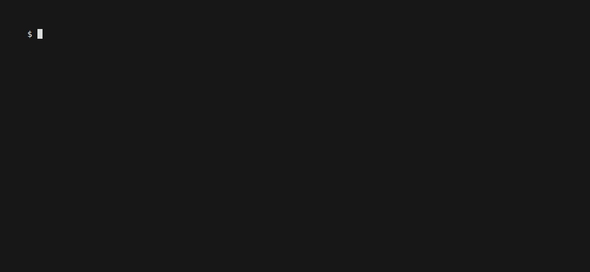

# MarketCap Acquisition Engine

[](https://go.dev)
[](https://github.com/RLFreddy/marketcap-acquisition-engine/actions)
[](#)
[](#)
[](LICENSE)
[](https://github.com/RLFreddy)

> A concurrent data acquisition engine built in Go. Extracts, processes, and serializes market capitalization data from companiesmarketcap.com with caching, retry backoff, and race-condition-safe output.



## Features

- **Concurrent extraction** — NumCPU × 2 workers with async Colly requests
- **Caching** — 24h TTL, avoids redundant HTTP requests
- **Auto-pagination** — reads total count, calculates pages dynamically
- **Retry with backoff** — exponential backoff on failed requests
- **Docker-ready** — multi-stage build, ~22MB image, non-root user

## Docker

```bash
docker build -t companies-scraper .

docker run --rm -t \
  -v ./output:/workspace \
  -v ./config.yaml:/etc/scraper/config.yaml \
  companies-scraper
```

The CSV file is written to `./output/companies_YYYY-MM-DD.csv`.

## Local Execution

```bash
# Ensure config.yaml is in the current directory
go build -o scraper ./cmd/scraper/

./scraper
```

## Configuration

The scraper looks for `config.yaml` in this order:

- `./config.yaml` (local development)
- `/etc/scraper/config.yaml` (Docker mount)

If neither is found, built-in defaults are used — **it runs with zero configuration**.

To customize:

```bash
cp config.example.yaml config.yaml
```

Then edit only the values you want to override. See [`config.example.yaml`](config.example.yaml) for the full reference template with all defaults documented.

| Field | Default | Description |
|---|---|---|
| `pages` | `0` | Pages to scrape. `0` = auto-detect all |
| `workers` | `0` | Concurrent workers. `0` = auto (NumCPU × 2) |
| `delay` | `500ms` | Random delay between requests |
| `cache_ttl` | `24h` | HTTP cache TTL. `0` = never expire |
| `cache_dir` | `"./colly_cache"` | Cache directory. Empty = no cache |
| `retry_count` | `3` | Max retries on failure. `0` = no retry |
| `retry_delay` | `1s` | Base delay for retry backoff |
| `user_agent` | `Mozilla/5.0 ...` | User-Agent header |
| `dir` | `"."` | CSV output directory |
| `filename_prefix` | `"companies_"` | CSV filename prefix |

> **Validation:** all numeric fields are checked at startup. Negative values
> and unknown YAML keys are rejected with a clear error — no silent misbehavior.

## Commands

```bash
make lint
make test
make cover
make build
make clean
```

## Output

| Column     | Type    | Example       |
| ---------- | ------- | ------------- |
| Rank       | Integer | 1             |
| Name       | String  | NVIDIA (NVDA) |
| Market Cap | String  | $4.663 T      |
| Price      | String  | $192.53       |
| Today      | String  | 1.64%         |
| Country    | String  | USA           |

## Project Structure

```
├── .github/workflows/ci.yml
├── .golangci.yml
├── Makefile
├── config.yaml
├── cmd/scraper/main.go
├── internal/
│   ├── config/config.go
│   ├── domain/company.go
│   ├── scraper/
│   │   ├── scraper.go
│   │   ├── colly_scraper.go
│   │   ├── scraper_test.go
│   │   └── testdata/
│   ├── exporter/
│   │   ├── csv_exporter.go
│   │   └── csv_exporter_test.go
│   └── logger/logger.go
├── Dockerfile
├── entrypoint.sh
├── go.mod
└── go.sum
```

## License

MIT

---

Built by [RLFreddy](https://github.com/RLFreddy)
